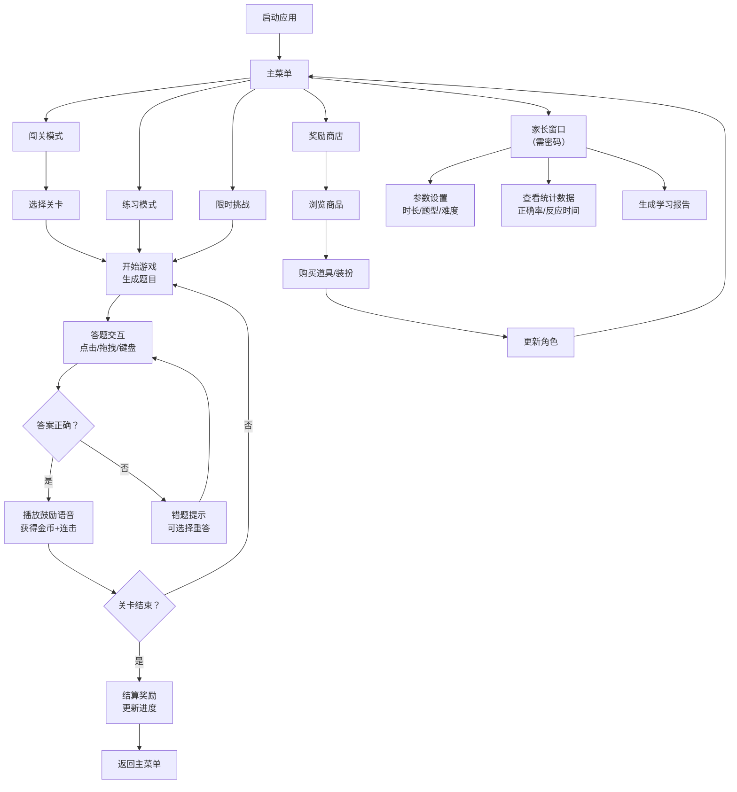

## 1. 产品概述

**算术小达人**是一款专为6-12岁儿童设计的桌面算术练习游戏，通过趣味化的游戏机制激发孩子的学习兴趣，提升基础算术能力与反应速度。

- 解决传统算术练习枯燥乏味的问题，通过游戏化元素（关卡、奖励、角色养成）让孩子主动学习
- 目标用户：6-12岁学龄儿童及其家长
- 产品价值：寓教于乐，在游戏中提升数学能力，同时让家长全面了解孩子的学习进度

## 2. 核心功能

### 2.1 用户角色

| 角色 | 进入方式 | 核心权限 |
|------|----------|----------|
| 儿童用户 | 直接启动应用 | 练习算术、闯关挑战、领取奖励、角色换装 |
| 家长用户 | 密码验证进入家长窗口 | 设置每日时长、题型范围、最高难度，查看学习数据统计 |

### 2.2 功能模块

1. **主菜单**：游戏模式选择、角色展示、入口导航
2. **关卡选择**：闯关地图、关卡进度、星级评价
3. **练习模式**：无压力练习、错题重来、专项练习
4. **限时挑战**：计时答题、连击奖励、排名系统
5. **奖励商店**：金币消费、道具购买、角色换装
6. **家长窗口**：参数设置、数据统计、学习报告
7. **游戏内核**：题目生成、难度自适应、语音鼓励、数据记录

### 2.3 页面详情

| 页面名称 | 模块名称 | 功能描述 |
|----------|----------|----------|
| 主菜单页面 | 角色展示区 | 显示当前装扮的角色，支持点击互动 |
| 主菜单页面 | 模式选择区 | 闯关模式、练习模式、限时挑战、奖励商店、家长中心五大入口 |
| 主菜单页面 | 状态栏 | 显示金币数量、连续登录天数、今日已玩时长 |
| 闯关地图页面 | 地图区域 | 可视化关卡地图，显示已解锁/未解锁/已通关状态 |
| 闯关地图页面 | 关卡详情 | 显示关卡目标、推荐难度、奖励内容 |
| 游戏页面 | 题目展示区 | 根据题型动态展示题目内容 |
| 游戏页面 | 答题交互区 | 支持点击、拖拽、键盘输入多种交互方式 |
| 游戏页面 | 状态信息区 | 显示当前得分、连击数、剩余时间（限时模式）、道具栏 |
| 游戏页面 | 反馈动画区 | 正确/错误反馈动画、语音鼓励播放 |
| 奖励商店页面 | 商品展示区 | 道具、皮肤、装扮的分类展示 |
| 奖励商店页面 | 购买交互区 | 查看详情、购买、试用功能 |
| 家长窗口页面 | 参数设置区 | 设置每日游戏时长、题型范围、最高难度、家长密码 |
| 家长窗口页面 | 数据统计区 | 正确率、反应时间、常错题型、连续练习天数等图表展示 |
| 家长窗口页面 | 学习报告区 | 周/月学习报告生成与导出 |

## 3. 核心流程

用户启动应用后，首先看到主菜单，可以选择进入闯关模式、练习模式或限时挑战。在游戏过程中，系统根据孩子的表现动态调整难度，正确答题获得金币和连击奖励，错误时可选择重答或使用提示道具。积累的金币可在商店购买道具和角色装扮。家长可通过密码验证进入家长窗口，设置学习参数并查看详细的学习数据统计。

## 4. 用户界面设计

### 4.1 设计风格

**设计方向：活泼可爱的卡通风格（Playful/Cartoon）**

- **主色调**：天蓝色（#4A90D9）作为主色调，代表智慧与冷静；搭配明黄色（#FFC107）作为强调色，代表活力与快乐
- **辅助色**：草绿色（#4CAF50）表示正确，珊瑚红（#F44336）表示错误，淡紫色（#9C27B0）用于奖励
- **按钮风格**：圆角卡通按钮，带有轻微3D效果和阴影，悬停时有弹跳动画
- **字体选择**：
  - 标题字体：ZCOOL KuaiLe（站酷快乐体），活泼可爱，符合儿童审美
  - 正文字体：Noto Sans SC，清晰易读
- **布局风格**：卡片式布局，大量圆角和柔和阴影，元素间距宽松
- **图标风格**：扁平化卡通图标，使用emoji增强趣味性，颜色鲜艳

### 4.2 页面设计概述

| 页面名称 | 模块名称 | UI元素 |
|----------|----------|--------|
| 主菜单页面 | 角色展示区 | 大号角色立绘，支持点击互动动画，角色周围环绕粒子光效 |
| 主菜单页面 | 模式选择区 | 五个彩色圆形按钮，带有图标和文字，悬停放大效果 |
| 主菜单页面 | 状态栏 | 顶部半透明条，显示金币💰、火焰🔥（连续天数）、时钟⏰图标 |
| 闯关地图页面 | 地图区域 | 蜿蜒的路径连接各关卡节点，已通关显示⭐，进行中显示🔵，未解锁显示🔒 |
| 闯关地图页面 | 关卡详情 | 底部弹出卡片，显示关卡图标、目标描述、奖励预览 |
| 游戏页面 | 题目展示区 | 大号题目卡片，数字和符号使用不同颜色区分，有渐变背景 |
| 游戏页面 | 答题交互区 | 根据题型动态变化：选择题显示彩色选项按钮，填空题显示数字键盘，拖拽题显示可拖动元素 |
| 游戏页面 | 状态信息区 | 顶部显示得分、连击火焰特效、倒计时进度条（限时模式）、道具栏 |
| 游戏页面 | 反馈动画区 | 正确时显示🎉和绿色对勾，错误时显示💪和红色叉号，带有缩放动画 |
| 奖励商店页面 | 商品展示区 | 网格布局商品卡片，显示商品图标、价格、是否已拥有 |
| 奖励商店页面 | 购买交互区 | 弹窗显示商品详情，购买按钮带有金币飞入动画 |
| 家长窗口页面 | 参数设置区 | 开关控件、滑块控件、下拉选择框，清晰的分组标题 |
| 家长窗口页面 | 数据统计区 | 折线图（正确率趋势）、柱状图（题型分布）、饼图（时间分配） |
| 家长窗口页面 | 学习报告区 | 结构化报告卡片，支持导出按钮 |

### 4.3 响应式

- **桌面优先设计**：主窗口尺寸固定为1280x800，支持全屏模式
- **触控优化**：所有交互元素尺寸不小于48x48px，适合触摸屏操作
- **字体缩放**：支持120%和150%字体放大，适应不同视力需求
- **键盘支持**：所有功能可通过键盘快捷键操作，支持方向键导航

### 4.4 动画与交互

- **页面切换**：使用淡入淡出+滑动过渡动画，持续300ms
- **按钮交互**：悬停时放大1.05倍，点击时缩小0.95倍，带有弹性效果
- **正确反馈**：绿色对勾从中心缩放出现，伴随彩色粒子爆炸效果
- **错误反馈**：红色叉号轻微抖动，提示文字淡入
- **连击效果**：连续答对时，连击数字逐渐变大并带有火焰拖尾
- **奖励获得**：金币图标从屏幕各处飞入状态栏，带有弹跳轨迹
- **角色互动**：点击角色时，角色做出随机表情和动作，如眨眼、挥手
