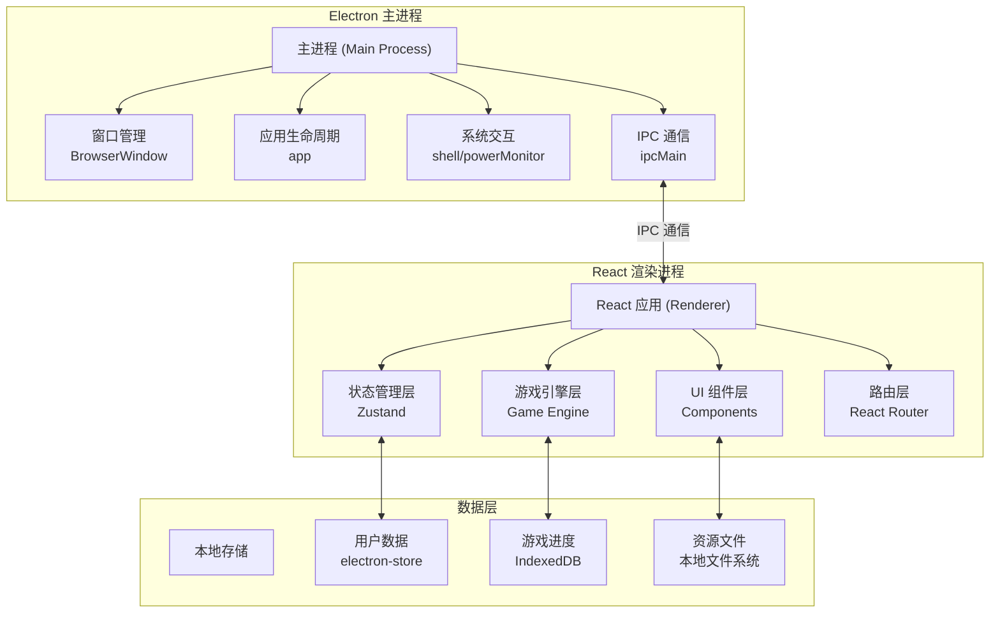

## 1. 架构设计

本项目采用 Electron + React + TypeScript 技术栈，构建跨平台桌面应用。整体架构分为三层：Electron 主进程层负责窗口管理和系统交互，React 渲染层负责 UI 展示和用户交互，数据层负责本地数据持久化。



## 2. 技术描述

- **桌面框架**：Electron@29，提供跨平台桌面应用能力，支持 Windows/macOS/Linux
- **前端框架**：React@18 + TypeScript@5，组件化开发，类型安全
- **构建工具**：Vite@5，快速的开发服务器和构建能力
- **状态管理**：Zustand@4，轻量级状态管理，简单易用
- **路由管理**：React Router@6，单页应用路由
- **样式方案**：TailwindCSS@3，原子化 CSS 框架，快速构建 UI
- **动画库**：Framer Motion@11，流畅的 React 动画，支持手势交互
- **图表库**：Recharts@2，React 图表组件库，用于家长统计页面
- **数据持久化**：
  - electron-store@8：存储用户设置、金币、装扮等简单数据
  - IndexedDB（dexie@4）：存储游戏记录、错题本等大量结构化数据
- **语音合成**：Web Speech API（浏览器内置），实现语音鼓励功能
- **拖拽交互**：@dnd-kit/core + @dnd-kit/sortable，支持拖拽答题
- **Electron 打包**：electron-builder@24，打包为各平台安装包

## 3. 路由定义

| 路由路径 | 页面名称 | 功能描述 |
|----------|----------|----------|
| `/` | 主菜单页面 | 游戏入口，模式选择，角色展示 |
| `/map` | 闯关地图页面 | 关卡选择，进度展示 |
| `/game` | 游戏页面 | 答题界面，支持多种题型 |
| `/practice` | 练习模式页面 | 无压力练习，专项训练 |
| `/challenge` | 限时挑战页面 | 计时答题，连击奖励 |
| `/shop` | 奖励商店页面 | 道具购买，角色换装 |
| `/parent` | 家长窗口页面 | 参数设置，数据统计（需密码验证） |
| `/parent/login` | 家长登录页面 | 密码验证入口 |

## 4. 数据模型

### 4.1 数据模型定义

```mermaid
erDiagram
    USER_SETTINGS {
        string parentPassword PK "家长密码"
        int dailyTimeLimit "每日时长限制（分钟）"
        string[] enabledQuestionTypes "启用的题型"
        int maxDifficulty "最高难度等级（1-10）"
        boolean soundEnabled "是否开启音效"
        boolean voiceEnabled "是否开启语音鼓励"
    }
    
    PLAYER_DATA {
        int coins PK "金币数量"
        int currentLevel "当前闯关进度"
        int streakDays "连续练习天数"
        string lastPlayDate "上次游戏日期"
        int totalPlayTime "总游戏时长（分钟）"
        string currentOutfit "当前装扮ID"
        string[] unlockedOutfits "已解锁装扮列表"
        int[] inventory "道具库存 [道具ID: 数量]"
    }
    
    LEVEL {
        int levelId PK "关卡ID"
        string name "关卡名称"
        int difficulty "难度等级"
        string[] questionTypes "包含题型"
        int questionCount "题目数量"
        int timeLimit "时间限制（秒）"
        int star1Score "1星目标分数"
        int star2Score "2星目标分数"
        int star3Score "3星目标分数"
        int coinReward "通关金币奖励"
        boolean unlocked "是否解锁"
        int stars "获得星级（0-3）"
        int bestScore "最佳成绩"
    }
    
    GAME_RECORD {
        string recordId PK "记录ID"
        string date "游戏日期"
        string mode "游戏模式"
        int levelId "关卡ID"
        int score "得分"
        int correctCount "正确题数"
        int totalCount "总题数"
        float accuracy "正确率"
        float avgResponseTime "平均反应时间（秒）"
        int maxCombo "最大连击数"
        int playTime "游戏时长（秒）"
    }
    
    WRONG_QUESTION {
        string questionId PK "题目ID"
        string questionType "题目类型"
        string questionContent "题目内容"
        string userAnswer "用户错误答案"
        string correctAnswer "正确答案"
        int wrongCount "错误次数"
        string lastWrongDate "上次错误日期"
    }
    
    QUESTION {
        string questionId PK "题目ID"
        string type "题目类型"
        int difficulty "难度等级"
        string content "题目内容"
        string answer "正确答案"
        string[] options "选项（选择题）"
        string hint "提示信息"
    }
    
    SHOP_ITEM {
        string itemId PK "商品ID"
        string category "分类：prop/outfit"
        string name "商品名称"
        string description "商品描述"
        int price "价格（金币）"
        string icon "图标"
        string effect "道具效果/装扮属性"
        boolean purchased "是否已购买"
    }
```



### 4.2 数据结构定义（TypeScript）

```typescript
// 用户设置
interface UserSettings {
  parentPassword: string;
  dailyTimeLimit: number;
  enabledQuestionTypes: QuestionType[];
  maxDifficulty: number;
  soundEnabled: boolean;
  voiceEnabled: boolean;
}

// 玩家数据
interface PlayerData {
  coins: number;
  currentLevel: number;
  streakDays: number;
  lastPlayDate: string;
  totalPlayTime: number;
  currentOutfit: string;
  unlockedOutfits: string[];
  inventory: Record<string, number>;
}

// 题目类型
type QuestionType = 
  | 'addition'       // 加法
  | 'subtraction'    // 减法
  | 'multiplication' // 乘法
  | 'division'       // 除法
  | 'comparison'     // 大小比较
  | 'pattern'        // 找规律
  | 'completion';    // 补全算式

// 难度等级 1-10
type DifficultyLevel = 1 | 2 | 3 | 4 | 5 | 6 | 7 | 8 | 9 | 10;

// 题目
interface Question {
  id: string;
  type: QuestionType;
  difficulty: DifficultyLevel;
  content: string;
  answer: string | number;
  options?: (string | number)[];
  hint?: string;
  displayData?: {
    expression?: string;
    numbers?: number[];
    operators?: string[];
    blanks?: number[];
  };
}

// 关卡
interface Level {
  levelId: number;
  name: string;
  difficulty: DifficultyLevel;
  questionTypes: QuestionType[];
  questionCount: number;
  timeLimit: number;
  starThresholds: [number, number, number];
  coinReward: number;
  unlocked: boolean;
  stars: number;
  bestScore: number;
}

// 游戏记录
interface GameRecord {
  id: string;
  date: string;
  mode: 'adventure' | 'practice' | 'challenge';
  levelId?: number;
  score: number;
  correctCount: number;
  totalCount: number;
  accuracy: number;
  avgResponseTime: number;
  maxCombo: number;
  playTime: number;
}

// 错题
interface WrongQuestion {
  id: string;
  type: QuestionType;
  content: string;
  userAnswer: string | number;
  correctAnswer: string | number;
  wrongCount: number;
  lastWrongDate: string;
}

// 商店商品
interface ShopItem {
  id: string;
  category: 'prop' | 'outfit';
  name: string;
  description: string;
  price: number;
  icon: string;
  effect?: {
    type: 'hint' | 'skip' | 'double_coin' | 'time_extend';
    value: number;
  };
  outfitData?: {
    avatar: string;
    color: string;
    accessories?: string[];
  };
  purchased: boolean;
}

// 游戏状态
interface GameState {
  mode: 'adventure' | 'practice' | 'challenge';
  currentQuestion: Question | null;
  questionIndex: number;
  totalQuestions: number;
  score: number;
  combo: number;
  maxCombo: number;
  correctCount: number;
  wrongCount: number;
  timeRemaining: number;
  responseTimes: number[];
  usedHints: number;
  activeEffects: string[];
}
```

## 5. 核心模块设计

### 5.1 题目生成引擎

| 模块 | 职责 | 关键算法 |
|------|------|----------|
| 题目生成器 | 根据题型和难度动态生成题目 | 随机数生成、约束满足算法 |
| 难度控制器 | 根据玩家表现动态调整难度 | 自适应算法（正确率+反应时间加权） |
| 题型调度器 | 确保各题型均衡出现 | 轮询调度+权重调整 |

### 5.2 游戏引擎

| 模块 | 职责 | 关键机制 |
|------|------|----------|
| 游戏流程控制 | 管理游戏生命周期、题目流转 | 状态机模式 |
| 答题验证器 | 验证答案正确性、记录反应时间 | 精确计时、多格式答案匹配 |
| 奖励计算器 | 计算得分、金币、连击奖励 | 基础分×难度系数×连击倍率 |
| 语音合成器 | 播放鼓励语音、题目朗读 | Web Speech API |

### 5.3 数据统计引擎

| 模块 | 职责 | 关键算法 |
|------|------|----------|
| 统计计算器 | 计算正确率、平均反应时间等指标 | 滑动窗口统计、加权平均 |
| 错题分析器 | 识别常错题型、知识点薄弱环节 | 频率统计、聚类分析 |
| 报告生成器 | 生成周/月学习报告 | 数据聚合、趋势分析 |

## 6. 性能与安全

- **性能优化**：使用 React.memo 避免不必要重渲染，IndexedDB 批量操作，懒加载非关键组件
- **安全措施**：家长密码使用 bcrypt 加密存储，敏感操作需要二次验证，禁用开发者工具（生产环境）
- **数据备份**：支持游戏数据导出为 JSON 文件，可导入恢复
- **离线支持**：完全本地运行，无需网络连接
